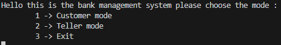
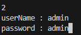
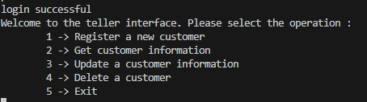

# Introduction

This is bank management system with 2 roles : **Teller** and **Customer**

- **Teller** : The person working on the bank and charged of serving customers. He/She can :
    - Register new customer
    - Update customer informations
    - Delete customer
    - Get customer informations 

- **Customer** : Bank account holder. He/She can :
    - Get balance information
    - Submit cash
    - Withdraw cash

The database contains 4 tables:
- **Customers** : customers informations with each person has an account id
- **Accounts** : Contains account informations the id is the customer account id
- **Tellers** : Tellers informations (initialized with one teller with admin:admin as userName:password)

# Build and install software

To build and install software run the following command

```bash
mkdir build
cd build
cmake -DCMAKE_BUILD_TYPE=Release -DCMAKE_INSTALL_PREFIX=/custom/installation/directory ..
cmake --build .
```

To run the software execute the following commands :

```bash
cd /path/to/project
/custom/installation/directory/main
```

For the first time an initialization step is done by generating a bank.db database file with necessary tables.

# User interface
This version is work with a CLI (Command-line interface). The main interface as following :



Log as a teller with the default userName and password :



Enjoy the control interface and create your first customer:




